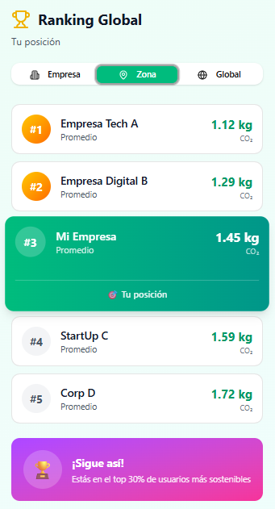
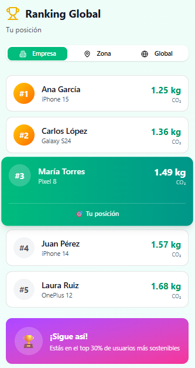

# Documento de Alcance

Documento de alcance de la aplicacion en donde se especifica la serie de especificaciones que va a cumplir.

## Historia de usuario

- Como usuario quiero que me de el tiempo de uso de cada aplicacion para saber cuanto tiempo paso en cada aplicacion.
- Como usuario quiero que me de la huella de carbono que produzco cada vez que utilizo una aplicacion para poder ser consciente de mi huella de carbono digital.
- Como usuario quiero que me ponga en un ranking de cuanta huella de carbono produce mi dispostivo para poder ser consciente de mi huella de carbono digital.
- Como usuario quiero que me compare cuanta huella de carbono he proucido con algo mas visual para poder ser consciente de mi huella de carbono digital.
- Como usuario quiero que pueda exportar los datos en un pdf para poder exponerlo de una forma sencilla.
- Como empresa quiero poder agregar a todos mis empleados para poder saber la huella de carbono digital que tiene mi organizacion

## Funcionalidades
- Multilenguaje, se incluira Español e Inglés pero tambien se planteara meter otros lenguajes orientales como puede ser Mandarín e Hindú.
- Intuitiva y acesible.
- Poder filtrar y ordenar las aplicaciones.
- Creacion de un backend para guardar historico y por dispositivo para compararlo y ver estadisticas globales (Ver por empresa, zonas...).

## Descripciones de las pantallas

### Pantalla Principal
- Objetos con los datos totales de huella de caarbono digital y de tiempo de uso del dia.
- Objetos con los datos de las cinco aplicaciones que mas gastan ordenados de de la que mas gasta a la que menos.

  <figure style="text-align: center;">
    
  </figure>

### Pantalla detalles

- Vista del gasto de cada aplicacion desarrollado con datos mas utiles.

  <figure style="text-align: center;">
    
  </figure>

  <figure style="text-align: center;">
    
  </figure>

  <figure style="text-align: center;">
    
  </figure>

### Pantalla Ranking
- Vista del ranking de gasto energetico personal en tu empresa.
- Vista del ranking de gasto energetico en tu zona.
- Vista del ranking de gasto energetico global.
- Vista de tu puesto en cada ranking.

  <figure style="text-align: center;">
    
  </figure>

  <figure style="text-align: center;">
    
  </figure>

  <figure style="text-align: center;">
    
  </figure>

### Pantalla Estadisticas
- Vista semanal, mensual y anual de los datos.
- Graficos del gasto de carbono personal con graficos reactivos.
- Comparativas con los datos anteriores.
- Opcion de exportacion de los datos a pdf.

  <figure style="text-align: center;">
    
  </figure>

### Pantalla Configuración
- Vista de los datos del usuario.
- Configuraciones del sistema (Idioma, modo claro/oscuro y generales).
- Opcion de cerrar sesión.

  <figure style="text-align: center;">
    
  </figure>

