# NetZero: Hacia la Neutralidad de la Huella Digital​

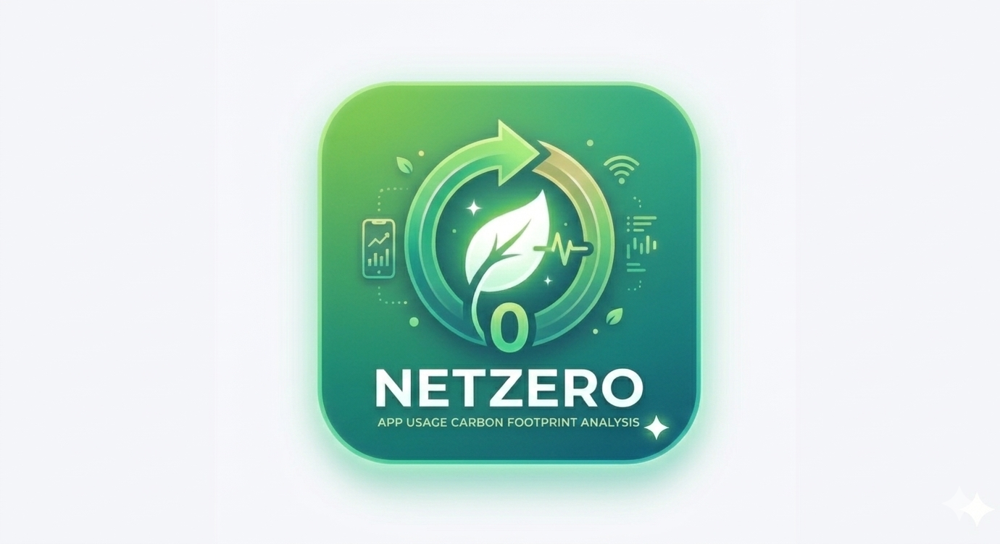

## Documento de Alcance

Documento de alcance de la aplicacion en donde se especifica la serie de especificaciones que va a cumplir.

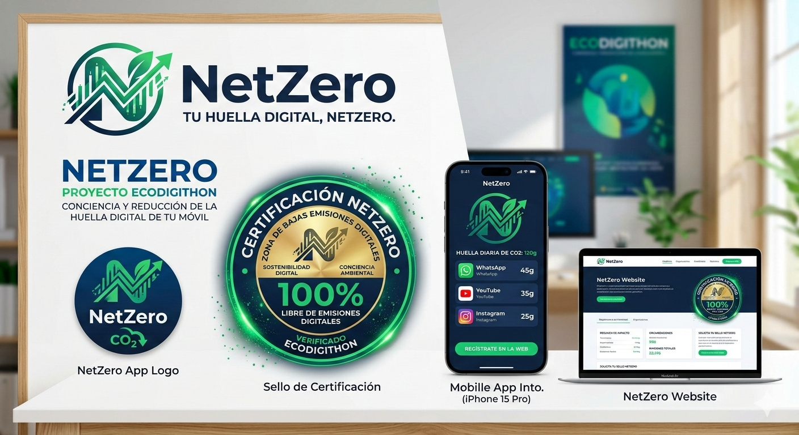

## Historia de usuario

- Como usuario quiero que me de el tiempo de uso de cada aplicacion para saber cuanto tiempo paso en cada aplicacion.
- Como usuario quiero que me de la huella de carbono que produzco cada vez que utilizo una aplicacion para poder ser consciente de mi huella de carbono digital.
- Como usuario quiero que me ponga en un ranking de cuanta huella de carbono produce mi dispostivo para poder ser consciente de mi huella de carbono digital.
- Como usuario quiero que me compare cuanta huella de carbono he proucido con algo mas visual para poder ser consciente de mi huella de carbono digital.
- Como usuario quiero que pueda exportar los datos en un pdf para poder exponerlo de una forma sencilla.
- Como empresa quiero poder agregar a todos mis empleados para poder saber la huella de carbono digital que tiene mi organizacion

## Funcionalidades

- Multilenguaje, se incluira Español e Inglés pero tambien se planteara meter otros lenguajes orientales como puede ser Mandarín e Hindú.
- Intuitiva y acesible.
- Poder filtrar y ordenar las aplicaciones.
- Creacion de un backend para guardar historico y por dispositivo para compararlo y ver estadisticas globales (Ver por empresa, zonas...).

## Descripciones de las pantallas

### Pantalla Principal

- Objetos con los datos totales de huella de carbono digital y de tiempo de uso del día.
- Objetos con los datos de las cinco aplicaciones que más gastan ordenados de la que más gasta a la que menos.

  <figure style="text-align: center;">
    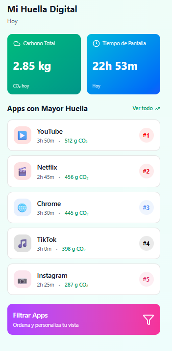
  </figure>

#### Apartado: Pantalla Principal Web

- Dashboard web con métricas globales de huella de carbono digital y tiempo de uso diario.
- Gráficos interactivos mostrando las aplicaciones más consumidas.
- Navegación intuitiva hacia otras secciones de la plataforma web.

  <figure style="text-align: center;">
    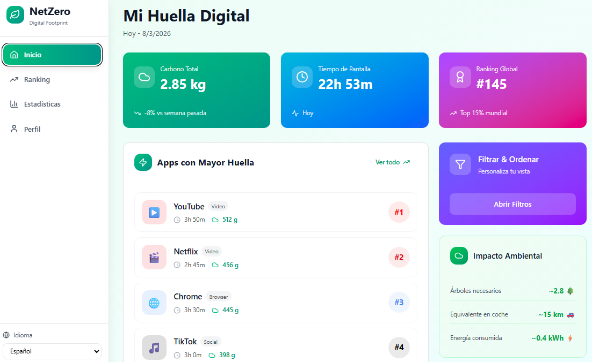
  </figure>

### Pantalla detalles

- Vista del gasto de cada aplicacion desarrollado con datos mas utiles.
  

    <figure style="text-align: center;">
      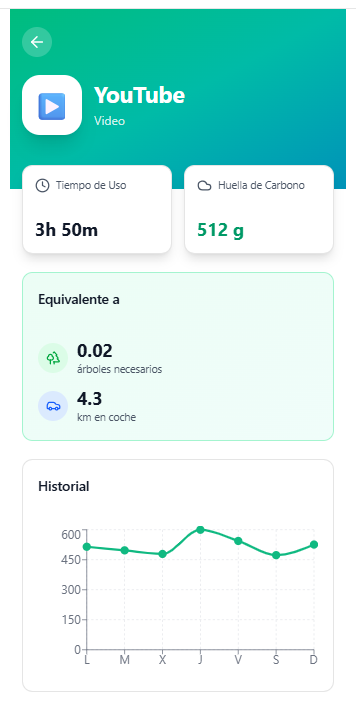
    </figure>

    <figure style="text-align: center;">
      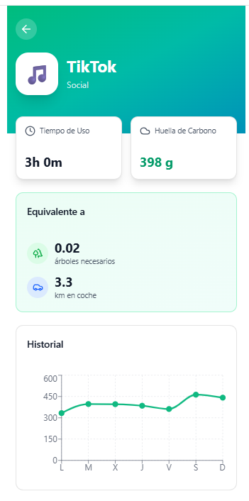
    </figure>

    <figure style="text-align: center;">
      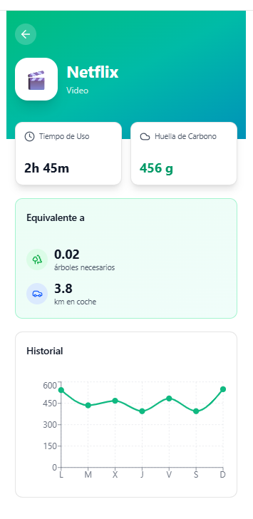
    </figure>
  

### Pantalla Ranking

- Vista del ranking de gasto energetico personal en tu empresa.
- Vista del ranking de gasto energetico en tu zona.
- Vista del ranking de gasto energetico global.
- Vista de tu puesto en cada ranking.
  

    <figure style="text-align: center;">
      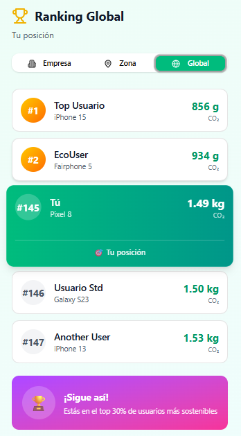
    </figure>

    <figure style="text-align: center;">
      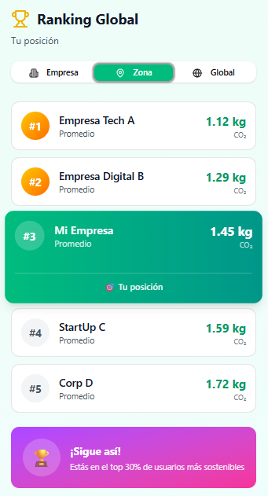
    </figure>

    <figure style="text-align: center;">
      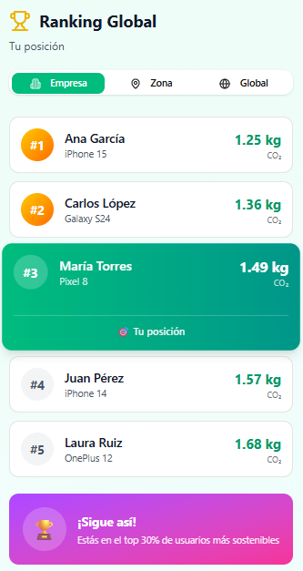
    </figure>
  

### Pantalla Estadísticas

- Vista semanal, mensual y anual de los datos.
- Gráficos del gasto de carbono personal con gráficos reactivos.
- Comparativas con los datos anteriores.
- Opción de exportación de los datos a PDF.

  <figure style="text-align: center;">
    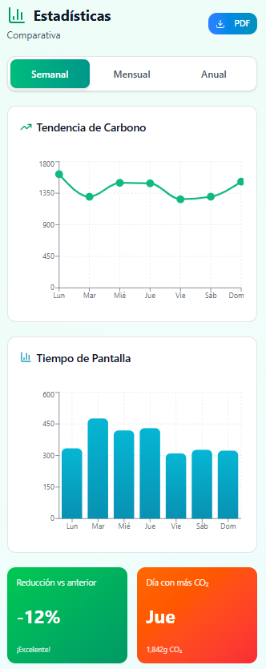
  </figure>

#### Apartado: Pantalla Estadísticas Web

- Visualización avanzada de datos históricos: semanal, mensual y anual.
- Gráficos dinámicos y comparativas con períodos anteriores.
- Exportación de reportes en PDF y otros formatos para análisis detallado.

  <figure style="text-align: center;">
    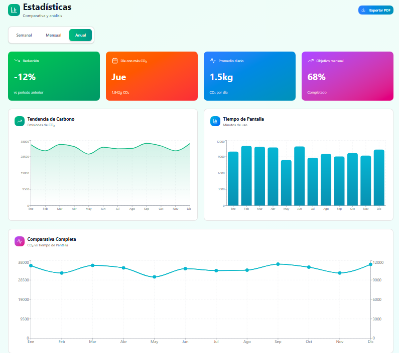
  </figure>

### Pantalla Configuración

- Vista de los datos del usuario.
- Configuraciones del sistema (Idioma, modo claro/oscuro y generales).
- Opcion de cerrar sesión.

  <figure style="text-align: center;">
    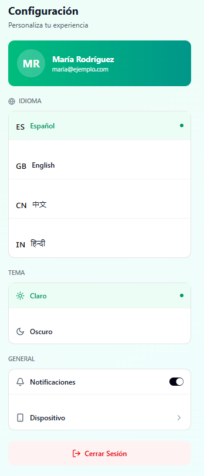
  </figure>

### Pantalla Clasificación

- Evaluación de la huella de carbono personal mediante una escala de letras de A a F.
- A: Excelente (huella mínima, hábitos sostenibles).
- B: Muy bueno (huella moderada, oportunidades de mejora).
- C: Bueno (huella promedio, necesita atención).
- D: Regular (huella alta, requiere cambios significativos).
- E: Malo (huella muy alta, requiere cambios urgentes).
- F: Muy Malo (huella excesiva, acción inmediata necesaria).
- Recomendaciones personalizadas basadas en la clasificación obtenida.

  <figure style="text-align: center;">
    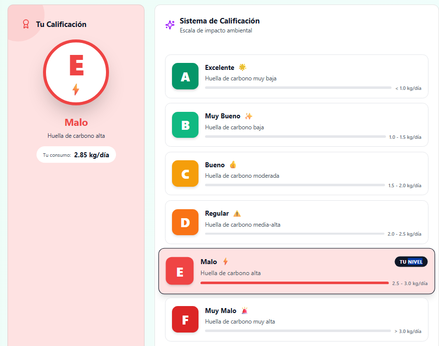
  </figure>

